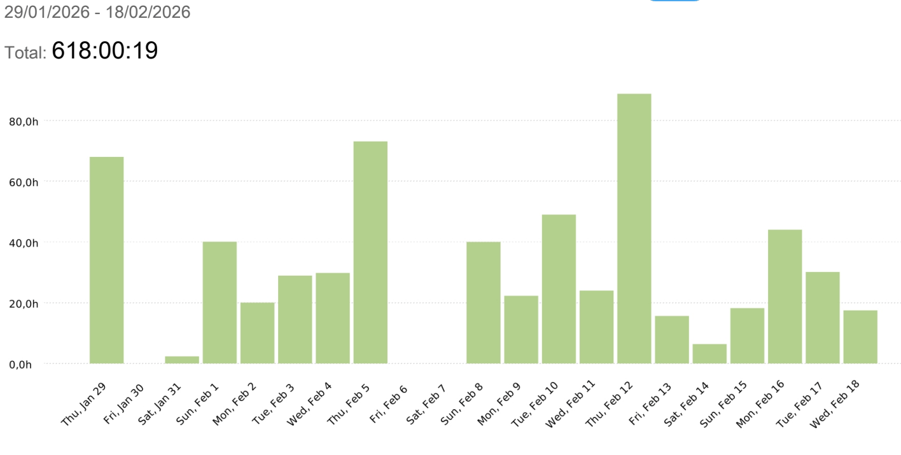
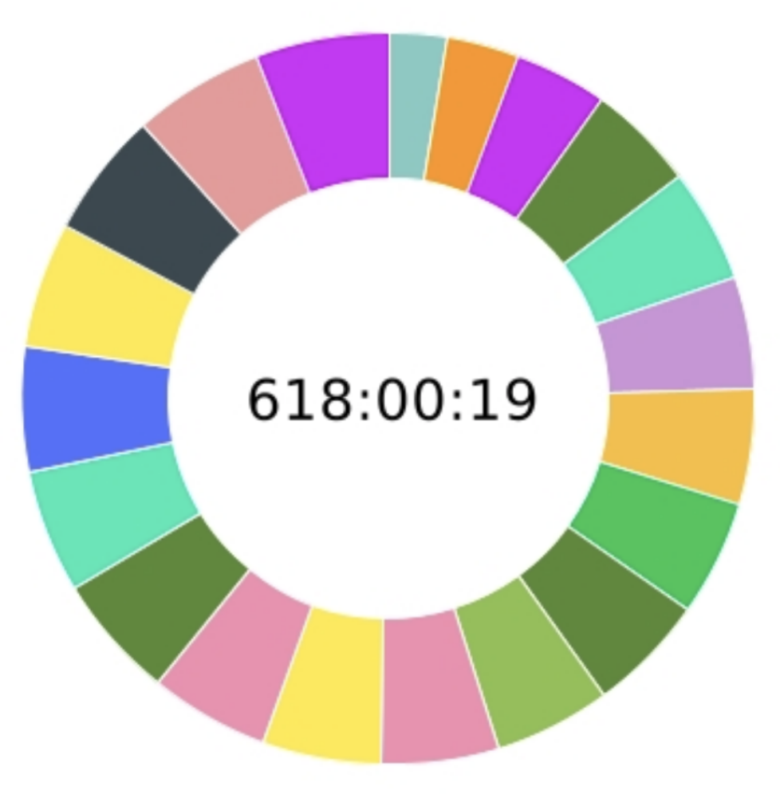

<h1>DP — Time Report</h1>

  <strong>Bookmerang</strong>

 

<picture>
  <source media="(prefers-color-scheme: dark)"
          srcset="../assets/img/logo-bookmerang-dark.png">
  <source media="(prefers-color-scheme: light)"
          srcset="../assets/img/logo-bookmerang-light.png">
  
</picture>

  

 

  

    <picture>
      <source media="(prefers-color-scheme: dark)"
              srcset="../assets/img/us-etsi-inf-dark.png">
      <source media="(prefers-color-scheme: light)"
              srcset="../assets/img/us-etsi-inf-light.png">
      
    </picture>
  

  

    

      <strong>Asignatura:</strong> ISPP (Curso 2025/26) 
      <strong>Grupo:</strong> 8 — <em>Bookmerang</em> 
      <strong>Grado:</strong> Ingeniería del Software 
      <strong>Centro:</strong> ETSII — Universidad de Sevilla
    

  

## Índice

- [1. Historial de Versiones](#1-historial-de-versiones)
- [2. Periodo del informe](#2-periodo-del-informe)
- [3. Resumen de dedicación](#3-resumen-de-dedicación)
- [4. Dedicación por miembro del equipo](#4-dedicación-por-miembro-del-equipo)

---

# 1. Historial de Versiones

| Versión | Fecha | Participantes | Resumen de los cambios |
|:------:|:-----------:|---------------|-----------------------|
| v1.0 | 05/03/2026 | Alejandro Castilla Barbadillo | Creación inicial del documento |

---

# 2. Periodo del informe

| Campo | Valor |
|------|------|
| Periodo analizado | 29/01/2026 – 18/02/2026 |
| Fuente de datos | Clockify |
| Total de horas registradas | **618:00:19** |

---

# 3. Resumen de dedicación

Durante el desarrollo del entregable **Devising a Project (DP)** el equipo registró un total de **618 horas de trabajo** utilizando la herramienta **Clockify** para el seguimiento del tiempo.

Este registro permite obtener una visión global del esfuerzo invertido por cada miembro del equipo.

---

# 4. Dedicación por miembro del equipo

*Figura 1. Distribución diaria de horas registradas por el equipo durante el periodo analizado (29/01/2026 – 18/02/2026). Cada barra representa el total de horas registradas en Clockify para cada día.*

 

*Figura 2. Distribución relativa del tiempo registrado por cada integrante del equipo. Cada segmento del gráfico circular representa la proporción de horas aportadas por cada miembro respecto al total registrado de 618:00:19.*

| Miembro | Tiempo registrado | Porcentaje |
|------|------|------|
| Javier Ulecia García | 15:55:35 | 2.58% |
| davescald | 19:38:09 | 3.18% |
| frarodrol | 25:15:41 | 4.09% |
| Adolfo Borrego González | 29:33:54 | 4.78% |
| samuel | 30:47:44 | 4.98% |
| Darío Román Jiménez | 30:52:00 | 4.99% |
| PDJ6975 | 31:05:59 | 5.03% |
| Julián Romero | 31:51:51 | 5.16% |
| Alejandro Castilla | 31:59:23 | 5.18% |
| Alejandro Carmona Reina | 32:02:20 | 5.18% |
| Fernando | 32:11:00 | 5.21% |
| Peter Carter | 32:21:32 | 5.24% |
| jessanqui | 32:36:45 | 5.28% |
| Alejandro Vela | 33:47:08 | 5.47% |
| Jose Manuel García Rosa | 33:47:28 | 5.47% |
| jiahu04 | 33:50:07 | 5.47% |
| antonioluisjf22 | 34:02:41 | 5.51% |
| Gersancar | 34:21:56 | 5.56% |
| Castri | 35:43:15 | 5.78% |
| Adrián Ramírez Gil | 36:15:51 | 5.87% |

---

# 5. Observaciones

- El seguimiento de horas se realizó mediante **Clockify**.
- Cada miembro registró sus horas de trabajo durante el desarrollo del entregable **DP**.
- La distribución refleja el esfuerzo aproximado de cada integrante dentro del proyecto.