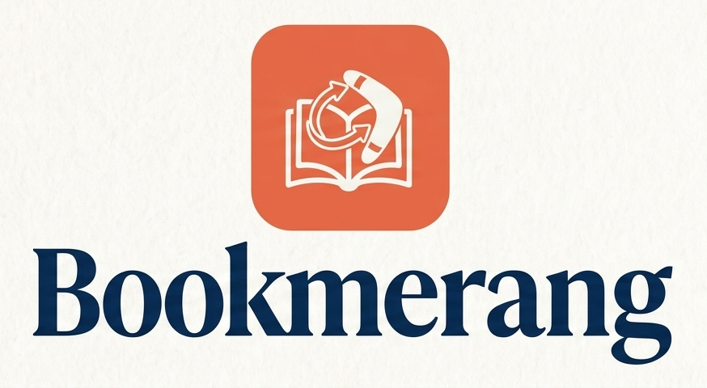
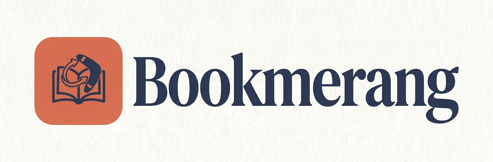

<h1>Marketing</h1>

<strong>Bookmerang</strong>

 

<picture>
  <source media="(prefers-color-scheme: dark)" srcset="../assets/img/logo-bookmerang-dark.png">
  <source media="(prefers-color-scheme: light)" srcset="../assets/img/logo-bookmerang-light.png">
  
</picture>

  

 

<picture>
  <source media="(prefers-color-scheme: dark)" srcset="../assets/img/us-etsi-inf-dark.png">
  <source media="(prefers-color-scheme: light)" srcset="../assets/img/us-etsi-inf-light.png">
  
</picture>

<strong>Asignatura:</strong> ISPP (Curso 2025/26) 
<strong>Grupo:</strong> 8 — <em>Bookmerang</em> 
<strong>Grado:</strong> Ingeniería del Software 
<strong>Centro:</strong> ETSII — Universidad de Sevilla

## Índice

- [1. Historial de Versiones](#1-historial-de-versiones)
- [2. Introducción y objetivo del marketing](#2-introducción-y-objetivo-del-marketing)
- [3. Identidad de marca](#3-identidad-de-marca)
- [4. Identidad visual](#4-identidad-visual)
- [5. Storyboard del anuncio principal](#5-storyboard-del-anuncio-principal)
- [6. Estrategia de redes sociales](#6-estrategia-de-redes-sociales)
- [7. Pilares de contenido](#7-pilares-de-contenido)
- [8. Estrategia de contenido dual](#8-estrategia-de-contenido-dual)
- [9. Plan de publicaciones](#9-plan-de-publicaciones)
- [10. Estrategia de memes](#10-estrategia-de-memes)
- [11. Campaña de lanzamiento](#11-campaña-de-lanzamiento)
- [12. Conclusión](#12-conclusión)

## 1. Historial de Versiones

| Versión | Fecha      | Participantes         | Resumen de los cambios      |
|--------|------------|------------------------|-----------------------------|
| v1.0   | 02/04/2026 | David Escudero Aldana | Creación del documento      |
| v1.1   | 03/04/2026 | David Escudero Aldana | Ampliación del documento    |

## 2. Introducción y objetivo del marketing

Bookmerang nace de una situación muy común: libros que, tras ser leídos, quedan olvidados en estanterías sin volver a utilizarse. Al mismo tiempo, muchas personas siguen queriendo descubrir nuevas lecturas, pero encuentran barreras económicas o simplemente no desean seguir acumulando más libros físicos.

En este contexto, Bookmerang propone una solución sencilla pero potente: transformar esos libros en circulación, conectando a personas cercanas para intercambiarlos de forma directa. La aplicación no solo facilita el intercambio, sino que convierte este proceso en una experiencia accesible, social y dinámica, apoyada en tecnología que simplifica cada paso.

El papel del marketing dentro de este proyecto no se limita a dar visibilidad a la aplicación, sino a construir una identidad clara y coherente que permita entender rápidamente qué es Bookmerang y por qué resulta diferente. En un entorno donde existen soluciones parciales, ya sea centradas en la compraventa o en la comunidad lectora, es fundamental comunicar de forma precisa el valor diferencial del producto.

Este documento tiene como objetivo definir esa estrategia de comunicación, estableciendo las bases de la identidad de marca, su expresión visual, el planteamiento del anuncio principal y la presencia en redes sociales. Todo ello se orienta a preparar el lanzamiento del producto y a sentar las bases para la construcción de una comunidad activa en torno a la lectura y el intercambio.

En definitiva, el marketing de Bookmerang busca algo más que promocionar una aplicación: pretende posicionar una nueva forma de acceder a libros, basada en compartir, reutilizar y conectar con otros lectores.

## 3. Identidad de marca

La identidad de marca de Bookmerang define cómo se percibe el producto más allá de su funcionalidad. En un proyecto como este, donde se combinan tecnología, intercambio físico y comunidad, es fundamental construir una marca clara, coherente y fácil de entender.

El objetivo no es solo diferenciarse de otras soluciones, sino transmitir de forma directa qué representa Bookmerang y por qué resulta relevante para el usuario.

## 3.1. Propósito

Bookmerang nace con un objetivo claro: evitar que los libros queden olvidados y facilitar que sigan circulando entre lectores.

Frente al modelo tradicional (comprar, leer y guardar), la plataforma propone una alternativa basada en compartir. Los libros no se conciben como objetos estáticos, sino como recursos que pueden seguir generando valor en manos de otras personas.

De este modo, Bookmerang no solo ofrece una funcionalidad, sino que impulsa una forma diferente de entender la lectura: más accesible, más dinámica y más conectada con otras personas.

## 3.2. Propuesta de valor

Bookmerang ofrece una forma sencilla de descubrir y obtener nuevos libros sin necesidad de comprarlos, conectando a usuarios cercanos para intercambiarlos de forma directa.

Su valor diferencial está en integrar en una misma experiencia elementos que normalmente aparecen separados:

- intercambio físico de libros
- conexión entre usuarios
- facilidad de uso
- sistema de recompensas

Estos elementos se concretan en:

- **Intercambio accesible:** acceso a nuevos libros sin coste económico directo.
- **Matching por proximidad:** conexión entre usuarios cercanos.
- **Proceso simple:** subida de libros rápida mediante ISBN.
- **Gamificación (InkDrops):** incentivo para participar y mantener actividad.

El resultado es una experiencia completa que combina utilidad, sencillez y motivación.

## 3.3. Público objetivo

Bookmerang se dirige a un público amplio dentro del ecosistema lector, pero especialmente a tres segmentos principales identificados en el estudio de mercado:

- **Lector social:** usuarios jóvenes (principalmente Gen Z y millennials) activos en redes sociales como TikTok o Instagram, que valoran compartir sus lecturas y formar parte de una comunidad.
- **Lector económico:** personas para las que el precio de los libros supone una barrera y que buscan maximizar su acceso a la lectura sin incurrir en un gasto elevado.
- **Usuario eco-friendly:** individuos concienciados con la sostenibilidad, interesados en reducir el consumo innecesario y en dar una segunda vida a los productos culturales.

Estos tres perfiles comparten un elemento común: la voluntad de acceder a más libros, pero desde un modelo diferente al tradicional. Bookmerang se posiciona precisamente en ese punto de intersección entre ahorro, comunidad y sostenibilidad.

## 3.4. Posicionamiento

El posicionamiento de Bookmerang se define a partir de su capacidad para integrar funcionalidades que, en el mercado actual, suelen encontrarse separadas. Mientras que algunas plataformas priorizan la interacción social y otras el intercambio de productos, Bookmerang combina ambas en una experiencia unificada.

En este sentido, la marca puede definirse como:

**La aplicación que convierte libros olvidados en nuevas historias compartidas.**

Este posicionamiento permite diferenciar a Bookmerang tanto de plataformas transaccionales como de redes sociales puramente orientadas a la lectura, situándola en un espacio propio donde la tecnología facilita conexiones reales entre personas a través de los libros.

## 3.5. Personalidad de marca

La personalidad de Bookmerang debe reflejar los valores del producto y ser coherente con la experiencia que ofrece. En este sentido, la marca se construye sobre una combinación de atributos:

- **Cercana:** transmite accesibilidad y facilidad de uso.
- **Cálida:** evoca la sensación de una librería o café acogedor.
- **Moderna:** incorpora elementos digitales y dinámicos propios de aplicaciones actuales.
- **Culta pero no elitista:** se relaciona con la lectura, pero sin resultar excluyente.
- **Social:** fomenta la interacción entre usuarios y la creación de comunidad.
- **Consciente:** integra valores de sostenibilidad y reutilización.

Esta personalidad permite a Bookmerang conectar emocionalmente con el usuario, evitando una percepción fría o puramente funcional de la aplicación.

## 3.6. Tono de comunicación

El tono de comunicación de Bookmerang debe ser coherente con su personalidad y con el público al que se dirige. Se caracteriza por:

- uso de lenguaje claro y directo
- frases breves y fáciles de entender
- enfoque cercano y natural
- mensajes con componente emocional, pero sin exageración
- equilibrio entre información e inspiración

Ejemplos de tono adecuado:

- “Ese libro no debería quedarse en una estantería.”
- “Haz match. Intercambia. Sigue leyendo.”
- “Tu próximo libro ya está más cerca de lo que crees.”

Se debe evitar un tono excesivamente técnico, corporativo o distante, así como un lenguaje demasiado informal que pueda restar credibilidad a la marca.

## 3.7. Mensajes clave

Para garantizar la coherencia en todas las comunicaciones, Bookmerang se apoya en una serie de mensajes clave que deben repetirse de forma consistente:

- Los libros pueden tener más de una vida.
- Intercambiar es mejor que acumular.
- Tu próximo libro está cerca de ti.
- Compartir cultura tiene recompensa.

Estos mensajes sintetizan la esencia del producto y facilitan su comprensión inmediata por parte del usuario.

## 3.8. Eslogan

El eslogan principal de Bookmerang es:

**“Que los libros dejen de acumular polvo y empiecen a acumular lectores.”**

Este eslogan resume de forma directa y memorable la propuesta de valor del producto, conectando tanto con el problema identificado como con la solución planteada. Además, refuerza la dimensión emocional de la marca, al poner el foco en el impacto que los libros pueden seguir teniendo cuando se comparten.

## 4. Identidad visual

La identidad visual de Bookmerang tiene como objetivo traducir los valores de la marca (cercanía, comunidad, sostenibilidad y modernidad) en un sistema gráfico coherente y reconocible. Dado que la aplicación combina un entorno digital con interacciones físicas (intercambio de libros), la estética debe reflejar ese equilibrio entre lo tecnológico y lo tangible.

El enfoque visual se basa en una combinación de elementos cálidos, orgánicos y realistas, junto con una interfaz moderna y limpia, generando una experiencia que resulta a la vez actual y emocionalmente cercana.

## 4.1. Concepto de logo

El logo de Bookmerang debe representar visualmente la idea central del producto: el movimiento continuo de los libros entre personas.

**Concepto base:** un libro que “vuelve”, un intercambio, un ciclo (economía circular) y conexión entre personas.

**Propuesta conceptual:**
Un símbolo que combine forma de libro abierto, movimiento circular (tipo boomerang/loop) y fluidez.

Esto permite:

- transmitir reutilización
- representar intercambio
- ser reconocible incluso en tamaños pequeños

## 4.2. Versiones del logo

Para que el sistema sea profesional, el logo debe tener varias versiones:

1. **Logo principal:** uso general (web, presentaciones, anuncio)

2. **Logo reducido:** uso como icono de app o favicon

3. **Logo horizontal:** para banners o cabeceras

4. **Logo sobre fondo oscuro:** versión adaptada en blanco o tonos claros

## 4.3. Paleta de colores

La paleta de colores de Bookmerang ha sido diseñada para transmitir calidez, cercanía y modernidad, manteniendo una coherencia visual con el concepto de lectura, comunidad y economía circular. La combinación de tonos cálidos con azules profundos permite equilibrar lo emocional con lo tecnológico.

**Colores principales**

- **Naranja (#e07a5f):** color principal de la marca. Representa cercanía, dinamismo y calidez. Está directamente asociado a la interacción, el intercambio y la acción dentro de la aplicación.
- **Azul (#3d405b):** aporta estabilidad, confianza y contraste. Refuerza el componente tecnológico del producto y equilibra la energía del naranja.
- **Blanco cálido (#fdfbf7):** utilizado como fondo principal. Genera sensación de limpieza, claridad y comodidad visual, alineándose con la experiencia de lectura.

**Colores secundarios**

- **Gris oscuro marrón (#3e2723):** evoca el material físico del libro (papel, madera, encuadernación). Se utiliza para aportar profundidad y contraste en elementos visuales.
- **Azul claro (#1f497d):** variante del azul principal para elementos secundarios, estados o detalles visuales. Añade dinamismo sin romper la coherencia cromática.
- **Naranja claro (#f2cc8f):** complemento del color principal. Se emplea en fondos suaves, destacados o elementos de apoyo, manteniendo la calidez de la marca.

**Aplicación de la paleta**

La paleta se utiliza siguiendo una jerarquía clara:

- Naranja → acciones, elementos interactivos, identidad
- Azul → texto principal, estructura, contraste
- Blanco → fondo base
- Secundarios → apoyo visual y variaciones

Esta combinación permite construir una identidad visual coherente, reconocible y adaptable a distintos formatos, desde la aplicación hasta redes sociales y material promocional.

## 4.4. Tipografías

La tipografía de Bookmerang refuerza la dualidad entre tecnología y cultura, combinando claridad digital con una ligera referencia al mundo editorial.

**Tipografía principal**

- Se utiliza una tipografía sans-serif moderna (como Inter o Poppins) para interfaz de usuario, textos principales y contenidos digitales.
- **Características:** alta legibilidad, diseño limpio y adaptabilidad a móvil y web.
- **Función:** transmitir modernidad, simplicidad y facilidad de uso.

**Tipografía secundaria**

- Se puede incorporar una tipografía serif ligera (como Playfair Display o Libre Baskerville) en usos puntuales: títulos destacados, elementos de branding y piezas más editoriales.
- **Características:** elegancia, asociación con libros y lectura y contraste con la tipografía principal.
- **Función:** aportar identidad literaria sin comprometer la claridad.

**Uso combinado**

El sistema tipográfico se basa en:

- Sans-serif → funcionalidad (app, UI, textos)
- Serif → expresión (branding, títulos, storytelling)

Este enfoque permite reforzar visualmente el posicionamiento de Bookmerang como una aplicación moderna con alma editorial.

## 4.5. Estilo visual

Este es el corazón visual de Bookmerang.

**Características clave:**

- iluminación cálida (golden hour)
- espacios reales (librerías, cafés)
- materiales visibles: madera, papel y tela
- profundidad de campo (bokeh)
- ambiente acogedor

**Sensación:** **“quiero estar ahí leyendo”**

**Qué se debe evitar:**

- imágenes frías o corporativas
- fondos blancos sin alma
- estética demasiado tecnológica
- stock genérico

**Referencia emocional:**

- librería indie
- café tranquilo
- intercambio humano

## 4.6. Estilo de interfaz

Cuando se muestre la app:

- interfaz limpia
- pocos elementos
- clara
- sin saturación

La UI acompaña la historia, no la domina.

Esto es clave en anuncios, redes y mockups.

## 4.7. Normas básicas de uso

Para mantener coherencia visual:

- usar siempre la paleta definida
- respetar márgenes del logo
- no deformar el símbolo
- evitar combinaciones de colores fuera del sistema
- mantener consistencia en iluminación y estilo

## 5. Storyboard del anuncio principal

El anuncio principal de Bookmerang tiene como objetivo comunicar de forma rápida, visual y emocional la propuesta de valor del producto. En un formato breve (20 segundos), se busca mostrar no solo el funcionamiento de la aplicación, sino también la experiencia que genera: descubrimiento, conexión, intercambio y recompensa.

A diferencia de un enfoque puramente funcional, el anuncio se centra en una narrativa progresiva que conecta el entorno digital con el mundo real. De este modo, se transmite que Bookmerang no es solo una aplicación, sino una herramienta que activa interacciones reales entre personas a través de los libros.

## 5.1. Objetivo del anuncio

El anuncio persigue tres objetivos principales:

- captar atención mediante una estética cuidada y cinematográfica
- explicar el funcionamiento básico (match → intercambio → recompensa)
- generar deseo de uso mostrando una experiencia atractiva y cercana

Además, busca reforzar la identidad de marca, transmitiendo calidez, modernidad y comunidad.

## 5.2. Concepto creativo

El concepto del anuncio se basa en una idea central: **“Del swipe al intercambio real”**.

Este concepto resume la transición clave que propone Bookmerang:

- una acción digital simple (deslizar)
- se convierte en una interacción física real (intercambiar un libro)

El anuncio muestra este recorrido completo en pocos segundos, reforzando la conexión entre tecnología y experiencia humana.

## 5.3. Secuencia de planos

**Plano 1 - Swipe inicial (0–3 s)**

Primerísimo plano del smartphone en mano. La protagonista desliza hacia la derecha una tarjeta de libro dentro del sistema de Matcher.

- enfoque en el gesto (thumb swipe)
- interfaz limpia y moderna
- luz cálida y profundidad de campo

**Función:** introducir la mecánica principal de forma clara y visual.

**Plano 2 - Notificación de match (3–6 s)**

Aparece una notificación flotante (overlay) sobre el móvil: **“Match Found!”**

La cámara abre plano o realiza un rack focus hacia el rostro de la protagonista, que sonríe.

Importante: la notificación no rompe la perspectiva del móvil, aparece como elemento integrado en el espacio.

**Función:** generar emoción y recompensa inmediata.

**Plano 3 - Desplazamiento hacia el BookSpot (6–11 s)**

Plano medio/seguimiento desde atrás. La protagonista se levanta y camina de forma natural hacia otra persona situada junto al BookSpot.

- movimiento fluido (no corriendo)
- entorno cálido (librería-café)
- presencia sutil del branding

**Función:** conectar mundo digital con mundo físico.

**Plano 4 - Intercambio de libros (11–15 s)**

Plano cerrado de manos. Ambas personas intercambian libros al mismo tiempo.

- textura real del papel
- contacto físico
- sincronía del movimiento

En el momento del intercambio aparece un efecto flotante: **“+ InkDrops”**.

Sin número, para mantener elegancia visual.

**Función:** mostrar el momento clave del producto: el intercambio + recompensa.

**Plano 5 - Apertura del entorno (15–17 s)**

Plano amplio que revela el espacio completo del BookSpot.

- ambiente acogedor
- presencia de otras personas
- sensación de comunidad

El plano comienza a suavizarse (ligero blur o transición).

**Función:** escalar la experiencia individual a algo colectivo.

**Plano 6 - Cierre de marca (17–20 s)**

Aparece el logo de Bookmerang en el centro.

- pequeño pulso/parpadeo
- el logo se desplaza lateralmente
- aparece el texto BOOKMERANG

Debajo: **“Que los libros dejen de acumular polvo y empiecen a acumular lectores.”**

Finalmente: popup de descarga.

- App Store / Google Play

**Función:** cerrar con identidad clara + llamada a la acción.

## 5.4. Mensaje final y CTA

El mensaje principal del anuncio se resume en:

- descubrir libros
- conectar con personas
- intercambiar
- seguir leyendo

El CTA final busca convertir esa experiencia en acción: **Descargar la aplicación**.

## 5.5. Justificación del enfoque

El storyboard se ha diseñado siguiendo una lógica progresiva que facilita la comprensión del producto en pocos segundos:

1. Acción simple → swipe
2. Recompensa inmediata → match
3. Acción real → intercambio
4. Refuerzo → InkDrops
5. Escala social → comunidad
6. Memoria de marca → logo + eslogan

Este enfoque permite:

- explicar el producto sin saturar
- generar conexión emocional
- reforzar la propuesta de valor

Además, el uso de una estética cálida y realista refuerza la identidad de Bookmerang, alineándose con su posicionamiento como una plataforma cercana, social y centrada en la experiencia del usuario.

## 6. Estrategia de redes sociales

La estrategia de redes sociales de Bookmerang tiene como objetivo construir una comunidad activa en torno a la lectura, aumentar la visibilidad del producto y generar interés previo a su lanzamiento. Dado que el valor del producto no se limita a su funcionalidad, sino que incluye una dimensión social y emocional, las redes sociales se convierten en un canal fundamental para transmitir la identidad de la marca y conectar con los usuarios.

La estrategia se basa en un enfoque híbrido que combina contenido cuidado y aspiracional con contenido más dinámico y viral, permitiendo así maximizar tanto la percepción de marca como el alcance.

## 6.1. Canales seleccionados

Se han seleccionado dos plataformas principales:

**Instagram:** canal principal de branding y comunidad.

- contenido visual cuidado
- carruseles informativos
- stories interactivas
- reels con estética trabajada

**Función:** construir imagen de marca, generar comunidad y mostrar el producto.

**TikTok:** canal principal de alcance y viralidad.

- vídeos cortos
- tendencias
- contenido más espontáneo
- memes y situaciones reales

**Función:** atraer nuevos usuarios, generar tráfico y posicionarse en #BookTok.

## 6.2. Objetivos

La estrategia de redes sociales se orienta a tres objetivos principales:

1. **Awareness (reconocimiento de marca):** dar a conocer Bookmerang como una nueva forma de acceder a libros.
2. **Comunidad:** crear una base de usuarios interesados en la lectura y el intercambio.
3. **Conversión:** motivar la descarga de la aplicación mediante contenido atractivo.

## 6.3. Público en redes

El público en redes coincide principalmente con el segmento de lector social:

- usuarios jóvenes (18–35 años)
- activos en redes sociales
- interesados en cultura, libros y contenido visual
- familiarizados con dinámicas tipo swipe (Tinder-like)

Además, se busca atraer progresivamente a los otros segmentos (económico y eco-friendly) mediante contenido específico.

## 6.4. Frecuencia de publicación

Para mantener consistencia sin saturar:

- 3 publicaciones semanales
- stories frecuentes (3–5 por semana)
- 1 reel mínimo semanal
- 1 meme semanal mínimo

Equilibrio entre calidad y constancia.

## 7. Pilares de contenido

La estrategia de contenido se estructura en cinco pilares principales, que permiten mantener coherencia y variedad en las publicaciones.

## 7.1. Producto

Contenido orientado a explicar el funcionamiento de la aplicación.

**Ejemplos:**

- cómo hacer match
- cómo subir un libro
- cómo funciona el intercambio
- qué son los InkDrops

**Objetivo:** claridad y comprensión.

## 7.2. Comunidad

Contenido que fomenta la interacción entre usuarios.

**Ejemplos:**

- preguntas (“¿qué libro nunca prestarías?”)
- experiencias lectoras
- opiniones
- hábitos de lectura

**Objetivo:** generar engagement.

## 7.3. Economía circular

Contenido que refuerza el valor diferencial del producto.

**Ejemplos:**

- reutilizar libros
- no acumular
- impacto ambiental
- lectura accesible

**Objetivo:** dar profundidad a la marca.

## 7.4. Gamificación

Contenido centrado en el sistema de recompensas.

**Ejemplos:**

- InkDrops
- progresión
- logros
- motivación para intercambiar

**Objetivo:** incentivar uso y retención.

## 7.5. Humor / memes

Contenido orientado a viralidad e identificación.

**Ejemplos:**

- situaciones lectoras
- acumulación de libros
- contradicciones (“no comprar más libros”)
- momentos de match

**Objetivo:** alcance y cercanía.

## 8. Estrategia de contenido dual

## 8.1. Línea premium

Contenido cuidado, visual y aspiracional.

**Características:**

- estética cálida
- composición cuidada
- storytelling
- coherente con branding

**Ejemplos:**

- escenas en librerías
- anuncios
- reels cinematográficos
- posts de marca

**Función:** construir imagen y generar confianza.

## 8.2. Línea viral

Contenido dinámico, rápido y adaptable a tendencias.

**Características:**

- memes
- vídeos cortos
- situaciones reales
- lenguaje más informal

**Ejemplos:**

- humor lector
- tendencias TikTok
- reacciones
- comparativas

**Función:** aumentar alcance y atraer nuevos usuarios.

## 8.3. Equilibrio entre ambas

El equilibrio entre ambas líneas permite:

- mantener una marca cuidada
- sin perder relevancia en redes
- ni capacidad de crecimiento

**Estrategia:** 60% contenido premium + 40% contenido viral.

## 9. Plan de publicaciones

El plan de publicaciones de Bookmerang tiene como objetivo trasladar la estrategia definida a acciones concretas en redes sociales. Para ello, se establece un calendario equilibrado que combina los distintos pilares de contenido y las dos líneas estratégicas (premium y viral), garantizando coherencia, variedad y constancia.

Este plan está diseñado como una simulación inicial de actividad previa al lanzamiento, con el objetivo de generar interés, construir comunidad y familiarizar a los usuarios con el funcionamiento de la aplicación.

## 9.1. Calendario de publicaciones (2 semanas)

**Semana 1**

- **Lunes - Meme (viral)**
  - “Yo diciendo que no voy a comprar más libros este mes”
  - imagen + texto humorístico
  - objetivo: identificación + alcance

- **Miércoles - Reel producto (premium)**
  - “Cómo funciona Bookmerang en 10 segundos”
  - swipe → match → intercambio
  - objetivo: explicar producto

- **Viernes - Carrusel comunidad (premium)**
  - “5 libros que nunca deberías dejar olvidados”
  - contenido visual + reflexión
  - objetivo: engagement

**Semana 2**

- **Lunes - Meme (viral)**
  - “Mi estantería viendo que me he descargado Bookmerang”
  - humor lector
  - objetivo: viralidad

- **Miércoles - Reel experiencia (premium)**
  - escena de intercambio en BookSpot
  - estética cálida
  - objetivo: deseo

- **Viernes - Post gamificación (mixto)**
  - “Intercambiar tiene recompensa”
  - explicación de InkDrops
  - objetivo: motivación

## 9.2. Tipos de contenido por formato

Para mantener consistencia:

**Posts (imagen/carrusel)**

- contenido más reflexivo
- comunidad
- valor de marca

**Reels**

- producto
- experiencia
- storytelling

**Stories**

- encuestas
- preguntas
- interacción directa

**Memes**

- contenido rápido
- identificación
- viralidad

## 9.3. Ejemplos de publicaciones

**Publicación 1 - Meme**

- **Texto:**  
  “Yo: no voy a comprar más libros  
  También yo: compra otro porque ‘este sí lo voy a leer ya’”
- **Visual:** imagen simple + estética Bookmerang
- **Objetivo:** identificación inmediata

**Publicación 2 - Reel producto**

- **Idea:** “De swipe a intercambio en 10 segundos”
- **Secuencia:**
  - Swipe
  - Match
  - Caminar
  - Intercambio
  - +InkDrops
- **Texto overlay:** “Tu próximo libro está más cerca de lo que crees”
- **Objetivo:** explicar producto sin saturar

**Publicación 3 - Carrusel comunidad**

- **Título:** “Libros que no deberían quedarse en una estantería”
- **Slides:**
  - portada
  - libros + frase
  - CTA: “Intercámbialo en Bookmerang”
- **Objetivo:** engagement + valor

**Publicación 4 - Gamificación**

- **Texto:** “Intercambiar tiene recompensa”
- **Visual:** libro + efecto “+ InkDrops”
- **Objetivo:** reforzar uso

**Publicación 5 - Reel emocional**

- **Idea:** “Ese momento en el que alguien quiere tu libro”
  - escena realista
  - sonrisa
  - intercambio
- **Objetivo:** emoción

**Publicación 6 - Meme**

- **Texto:** “Cuando haces match con un libro PERFECTO”
- **Objetivo:** viralidad

**Publicación 7 - Post de marca**

- **Texto:** “Que los libros dejen de acumular polvo y empiecen a acumular lectores.”
- **Objetivo:** branding

## 10. Estrategia de memes

La incorporación de memes dentro de la estrategia de marketing de Bookmerang responde a la necesidad de conectar con el público objetivo en un entorno digital dominado por contenido rápido, identificable y altamente compartible. En plataformas como Instagram y TikTok, el humor se ha consolidado como uno de los formatos más eficaces para aumentar el alcance orgánico y generar engagement.

En el caso de Bookmerang, los memes no se plantean como contenido aislado o informal, sino como una extensión coherente de la identidad de marca. Su función es humanizar la comunicación, reforzar la cercanía con el usuario y facilitar la identificación con situaciones reales relacionadas con la lectura y el comportamiento del lector.

## 10.1. Objetivo

La estrategia de memes tiene tres objetivos principales:

- aumentar el alcance mediante contenido fácilmente compartible
- generar identificación con situaciones reales del público lector
- humanizar la marca, haciéndola más cercana y accesible

A diferencia de otros formatos, el meme permite transmitir ideas complejas de forma inmediata, lo que lo convierte en una herramienta especialmente eficaz en fases iniciales de crecimiento.

## 10.2. Tipos de memes

Se definen varias categorías de memes alineadas con el universo de Bookmerang:

**Memes de comportamiento lector**

Basados en hábitos y contradicciones del usuario.

**Ejemplos:**

- “Compré libros para leer, no para acumular... creo”
- “Yo diciendo que no voy a comprar más libros”

Alta identificación.

**Memes de acumulación**

Relacionados con el problema que resuelve Bookmerang.

**Ejemplos:**

- estanterías llenas
- libros sin abrir
- compras impulsivas

Conecta directamente con la propuesta del producto.

**Memes de match**

Relacionados con el sistema tipo “swipe”.

**Ejemplos:**

- “cuando haces match con un libro perfecto”
- “rechazando libros como si fuera Tinder”

Introducen funcionalidad de forma divertida.

**Memes emocionales**

Basados en el vínculo con los libros.

**Ejemplos:**

- “me cuesta más prestar este libro que dinero”
- “no estoy listo para dejarlo ir”

Refuerzan la conexión emocional.

**Memes de comunidad**

Relacionados con compartir y conectar.

**Ejemplos:**

- “cuando alguien quiere el libro que llevabas años guardando”

Refuerzan el valor social.

## 10.3. Ejemplos de memes

**Ejemplo 1**

- **Texto:**
  - “Yo: no voy a comprar más libros”
  - “También yo: añade otro a la colección”
- **Formato:** imagen simple + texto

**Ejemplo 2**

- **Texto:** “Mi estantería viendo que me he descargado Bookmerang”
- **Formato:** reacción / imagen humorística

**Ejemplo 3**

- **Texto:** “Cuando haces match con UN LIBRO PERFECTO”
- **Formato:** reacción exagerada

**Ejemplo 4**

- **Texto:** “Ese momento en el que alguien quiere tu libro”
- **Formato:** emotivo + humor ligero

## 10.4. Reglas de uso

Para garantizar coherencia con la marca, se establecen las siguientes reglas:

- los memes deben estar siempre relacionados con el mundo lector
- deben ser fáciles de entender en menos de 2 segundos
- deben mantener una estética limpia y coherente con la identidad visual
- evitar el uso de plantillas excesivamente saturadas o fuera de contexto
- evitar humor ofensivo o demasiado informal
- mantener un equilibrio entre humor y branding

## 10.5. Integración en la estrategia

Los memes se integran dentro del calendario de publicaciones como contenido recurrente:

- mínimo 1 meme por semana
- alternancia con contenido premium
- uso estratégico para aumentar alcance

Además, sirven como puerta de entrada para nuevos usuarios, que pueden descubrir la marca a través de contenido viral antes de interactuar con publicaciones más informativas.

## 11. Campaña de lanzamiento

La campaña de lanzamiento de Bookmerang tiene como objetivo introducir la aplicación en el mercado de forma progresiva, generando interés, construyendo comunidad y facilitando la adopción inicial del producto. Dado que se trata de una plataforma cuyo valor depende en gran medida de la participación de los usuarios, el lanzamiento no debe entenderse como un evento puntual, sino como un proceso estructurado en fases.

La estrategia se divide en tres etapas: teaser, lanzamiento y post-lanzamiento, cada una con objetivos y tipos de contenido específicos.

## 11.1. Fase teaser

**Objetivo**

- generar curiosidad
- captar atención
- introducir el problema

**Enfoque**

No se presenta la app directamente.

Se trabaja sobre el problema:

- libros acumulando polvo
- ganas de leer más
- falta de intercambio

**Tipos de contenido**

- memes sobre acumulación
- preguntas a la comunidad
- frases cortas tipo:
  - “¿Cuántos libros tienes sin leer?”
  - “Ese libro podría estar en manos de otra persona”
- vídeos cortos sin mostrar app completa

**Resultado esperado**

- primeras interacciones
- curiosidad
- reconocimiento inicial

## 11.2. Fase lanzamiento

**Objetivo**

- presentar la app
- explicar funcionamiento
- generar descargas

**Contenido clave**

1. **Anuncio principal**  
   El storyboard desarrollado previamente se utiliza como pieza central.  
   Muestra:
   - swipe
   - match
   - intercambio
   - InkDrops

2. **Reels explicativos**  
   Ejemplo: “Cómo funciona Bookmerang en 10 segundos”.

3. **Posts de marca**
   - eslogan
   - propuesta de valor
   - identidad visual

4. **CTA claro**  
   Mensajes como:
   - “Descubre Bookmerang”
   - “Empieza a intercambiar”

**Resultado esperado**

- comprensión del producto
- primeras descargas
- validación inicial

## 11.3. Fase post-lanzamiento

**Objetivo**

- mantener actividad
- fomentar uso
- construir comunidad

**Tipos de contenido**

- testimonios de usuarios
- vídeos de intercambios reales
- memes continuos
- contenido de gamificación (InkDrops)
- preguntas e interacción

**Enfoque clave**

Pasar de: “descubre la app”  
A: “forma parte de la comunidad”

## 11.4. Integración de canales

La campaña se apoya principalmente en:

- Instagram → marca + comunidad
- TikTok → alcance + viralidad

Ambos canales trabajan de forma coordinada:

- contenido premium → Instagram
- contenido viral → TikTok

## 11.5. Mensaje global de la campaña

El mensaje que se transmite durante toda la campaña es:

- leer más no implica comprar más
- los libros pueden seguir circulando
- Bookmerang lo hace posible

## 12. Conclusión

La estrategia de marketing de Bookmerang se ha diseñado como un sistema completo que integra identidad de marca, comunicación visual, contenido digital y planificación de lanzamiento. A través de este enfoque, se busca no solo dar visibilidad al producto, sino construir una marca coherente, reconocible y alineada con las necesidades del usuario.

Bookmerang se posiciona como una solución diferencial dentro del mercado, al combinar intercambio de libros, tecnología y comunidad en una misma experiencia. Esta propuesta permite abordar de forma simultánea tres factores clave: el acceso económico a la cultura, la sostenibilidad y la interacción social entre lectores.

El desarrollo del storyboard del anuncio, la estrategia de redes sociales, el plan de publicaciones y la incorporación de contenido viral como los memes permiten trasladar esta propuesta de valor a un entorno realista de comunicación, adaptado a los hábitos actuales de consumo digital.

En conjunto, el plan presentado no solo refuerza la identidad del producto, sino que establece una base sólida para su lanzamiento y crecimiento. La combinación de una estética cuidada con una comunicación cercana y dinámica permite a Bookmerang aspirar a convertirse no solo en una herramienta útil, sino en una marca relevante dentro del ecosistema lector digital.